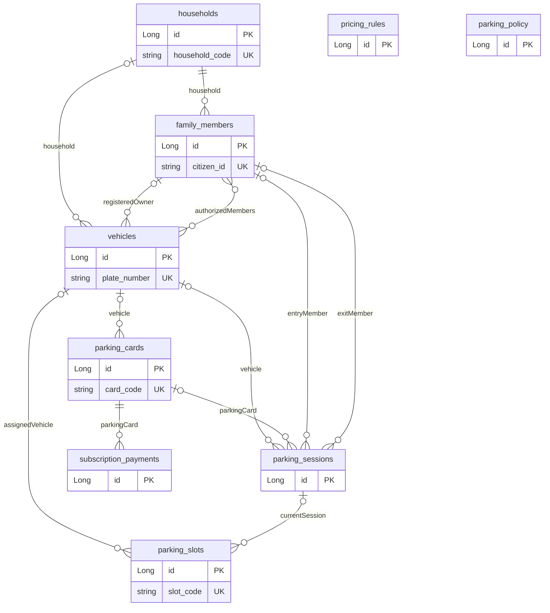

# Database — JPA mappings, quan hệ và giới hạn integrity

[Kiến trúc hệ thống](system.md) · [Phạm vi nghiệp vụ](../requirements/README.md) · [Traceability](../requirements/traceability.md) · [NV02](../requirements/nv02-cards-passes-pricing.md) · [NV08](../requirements/nv08-reporting.md)

## Mức bằng chứng và database technology

Trang này mô tả **JPA/entity-level mappings** và các additive security migrations trong source; không phải schema introspection hoặc production migration evidence. Annotation nullable/unique/precision là metadata cho ORM; chưa chứng minh mọi constraint/index/FK được tạo/enforced trên database triển khai. Những tên field không ghi `@Column(name=...)` được trình bày theo **Java property**, không tự invent tên SQL/naming strategy.

- [pom.xml](../../spring-web/pom.xml):6–39 dùng Spring Boot3.5.5/Java21/Spring Data JPA; :52–57 MySQL connector runtime, :64–68 H2 **test scope**. Có driver không chứng minh server/data source đang dùng engine đó.
- `spring-web/src/main/resources/db/migration/V1`–`V5` contain the additive account/session/audit/gate-evidence migrations; Flyway is configured disabled by default unless explicitly enabled. Source/config does not establish an active production profile or datasource.
- [ParkingFlowIntegrationTest](../../spring-web/src/test/java/vn/edu/parking/ParkingFlowIntegrationTest.java) uses isolated H2/create-drop; `SystemAccountMigrationTest` applied V1–V5 in H2 MySQL compatibility mode on 2026-10-09 with minimal legacy table fixtures. This is H2-only rehearsal, not evidence of migration success on a real MySQL server. The full Spring suite passed 108/108; none of this proves production schema/readiness.
- Production datasource URL/profile/DDL initialization/naming/collation/timezone vẫn **Not verified**. R01 đã đọc launchers không truyền datasource/profile args tường minh; launcher label/probe không proof Spring selection. Không chép credentials hoặc giá trị secret.

## Registry entities, tables và key fields

Chín entity dưới đây có `Long id @Id`; tám entity dùng `GenerationType.IDENTITY`, riêng ParkingPolicy không generated, Java default id1. Defaults Java không tự là SQL DEFAULT. Không `@Version`/`@Index` declaration trong các entity bodies đã đọc; unique constraints có thể tạo indexes khi DDL được áp dụng, chưa xác minh DB.

| Entity / table / exact source | Fields quan trọng và metadata khai báo |
| --- | --- |
| [Household](../../spring-web/src/main/java/vn/edu/parking/domain/Household.java):6–26 → `households` | `household_code` unique/not-null/length40; apartmentNumber not-null/40, buildingName/contactPhone/quota overrides/active; explicit `created_at`, @PrePersist nếu null |
| [FamilyMember](../../spring-web/src/main/java/vn/edu/parking/domain/FamilyMember.java):6–34 → `family_members` | `citizen_id` unique/length20 **không nullable=false**; fullName not-null; household bắt buộc; CCCD raw/id/fields/image path + registrationFaceImagePath length500, active. Không copy dữ liệu cá nhân |
| [Vehicle](../../spring-web/src/main/java/vn/edu/parking/domain/Vehicle.java):9–52 → `vehicles` | `plate_number` unique/not-null/20; ownerName not-null, legacy ownerPhone/apartmentNumber; household/registeredOwner/authorizedMembers; vehicleType STRING not-null/varchar50; registration/hãng/dòng/color/year/chassis/engine/seats/cylinderCapacityCc/fuel/path/active/created_at |
| [ParkingCard](../../spring-web/src/main/java/vn/edu/parking/domain/ParkingCard.java):7–25 → `parking_cards` | `card_code` unique/not-null/30; vehicle optional; status STRING not-null/Java ACTIVE; passType STRING/default PER_VISIT, validFrom/Until, subscriptionFee precision12 scale0. Không MonthlyPass entity riêng tại mapping này |
| [ParkingSession](../../spring-web/src/main/java/vn/edu/parking/domain/ParkingSession.java):7–43 → `parking_sessions` | entryPlate/entryTime/status/fee not-null; exitPlate/time; vehicle/card/entryMember/exitMember optional; detectedVehicleType STRING/varchar50; fee(12,0); manualOverride và face flags not-null/boolean default false declaration; face scores và entryFaceImagePath500 |
| [ParkingSlot](../../spring-web/src/main/java/vn/edu/parking/domain/ParkingSlot.java):6–59 → `parking_slots` | `slot_code` unique/not-null/20; floor/zone50; SlotType/VehicleType/SlotStatusOverride STRING30; assignedVehicle/currentSession optional; borrowedPlate20/Until/notes255/active; overdue và borrowed projections là helpers, không stored status audit |
| [PricingRule](../../spring-web/src/main/java/vn/edu/parking/domain/PricingRule.java):7–25 → `pricing_rules` | vehicleType STRING unique/not-null/varchar50; basePrice/overnightFee not-null; nightPrice/monthlyPrice/baseHours/extraBlockHours/extraBlockPrice; monetary fields precision12 scale0. Không effective-period/version history field ở entity |
| [SubscriptionPayment](../../spring-web/src/main/java/vn/edu/parking/domain/SubscriptionPayment.java):8–22 → `subscription_payments` | parkingCard bắt buộc; periodStart/end/amount/paidAt not-null; amount(12,0). Không method/collector/settlement/cancel/unpaid state hoặc session/PriceRule relation |
| [ParkingPolicy](../../spring-web/src/main/java/vn/edu/parking/domain/ParkingPolicy.java):5–13 → `parking_policy` | id default1, defaultMaxTwoWheelers/defaultMaxCars not-null; Java defaults2/1, không DB singleton/check guarantee |

## Additive security and gate-evidence schema

The opt-in Flyway migrations add `system_accounts`, `desktop_sessions`, `desktop_refresh_tokens`, `security_audit_events`, and `gate_evidence`; they do not create or replace the existing operational parking schema. V4 `gate_evidence` stores the opaque file references, owner account/device session, optional parking-session/member binding, operation/kind, content size/digests, recognition/face metadata, `captured_at`, `expires_at`, short recognition-validity deadline, single-use timestamp, and finite preservation approval fields. It adds FKs to the corresponding account, Desktop session, existing `parking_sessions`, and existing `family_members` tables, plus file uniqueness and expiry/owner/session/session indexes.

The migration rehearsal created only minimal `parking_sessions` and `family_members` fixture tables before applying V1–V5. This verifies the migration scripts against isolated H2 MySQL mode only; column types/collation/index behavior and FK compatibility with the actual operational MySQL schema remain unverified. Flyway was not enabled against or run on an operational database.

**Join table:** Vehicle:24–28 khai báo `vehicle_authorized_members` với `vehicle_id` và `family_member_id`; collection Set<FamilyMember>. Không explicit join-table PK/unique pair/index/FK constraint name/nullability trong annotation đã đọc; Set không thay DB constraint proof.

State enums/tham số fee được giữ dưới tên code, không đồng nhất với proposal. [VehicleType](../../spring-web/src/main/java/vn/edu/parking/domain/VehicleType.java):3–21 gồm BICYCLE_ELECTRIC_BICYCLE, MOTORBIKE, LARGE_MOTORBIKE, CAR, CAR_6_7, CAR_8_9; electric fuel không tạo charging schema/quyền sạc.

## Relationships, cardinality và FK boundaries

Tất cả ManyToOne/ManyToMany dưới đây khai báo fetch EAGER; không explicit cascade/orphanRemoval trong entity bodies này. “Bắt buộc” chỉ là JPA `optional=false`; mapping chưa proof named SQL FK/ON DELETE/unique target constraint được áp dụng.

| Quan hệ property / source | Cardinality theo mapping / điểm cần giữ |
| --- | --- |
| FamilyMember.household :11–12 | Mỗi member một household bắt buộc; một household có thể nhiều members; không tự quyền lái tất cả xe |
| Vehicle.household/registeredOwner :20–23 | Mỗi vehicle 0..1 household/owner; mỗi hộ/member có thể nhiều vehicles. Không constraint tự đảm bảo owner/member cùng hộ của xe |
| Vehicle.authorizedMembers :24–28 | 0..* ở cả hai phía qua join table; quyền theo từng xe. Không assume active/consent/giấy tờ được DB enforce |
| ParkingCard.vehicle :14–15 | 0..1 vehicle mỗi card; một vehicle có thể nhiều cards theo mapping, không one-active-card unique vehicle declaration |
| ParkingSession.vehicle/parkingCard :12–15 | 0..1 mỗi relation; parent có nhiều sessions. Guest được service nhận bằng vehicle null, không enum VISITOR column |
| ParkingSession.entryMember/exitMember :32–35 | Hai links độc lập tới member optional; không FK logic chứng minh member được quyền, cùng hộ hoặc khác-người-lấy hợp lệ |
| ParkingSlot.assignedVehicle/currentSession :33–37 | Mỗi slot optional vehicle/session; ManyToOne cho phép nhiều slots cùng reference theo mapping, **không OneToOne unique** |
| SubscriptionPayment.parkingCard :13–14 | Card bắt buộc; mỗi card có thể nhiều payment kỳ. Không unique period hoặc overlap constraint khai báo |

Trừ hai join columns tường minh, các relationship không có `@JoinColumn(name=...)`; tên physical FK columns/constraint names phụ thuộc ORM/naming/schema thực tế và còn unresolved. Không invent `household_id`, `exit_member_id` hoặc ON DELETE policy như DDL đã xác minh.

### ER diagram — quan hệ logic JPA, không DDL production

Many-to-many line rút gọn join table `vehicle_authorized_members`, không invent khóa của bảng nối. PricingRule/ParkingPolicy đứng riêng vì không relation JPA từ Session/Payment/Vehicle tới chúng; service lookup theo type/id không SQL FK. PK/UK labels chỉ annotations, citizen_id nullable/collation behavior và actual DB enforcement chưa verified. Hai links member của session không phải duplicate edge lỗi.

## Repositories và integrity thực sự quan sát

| Repository / exact reference | Queries và giới hạn |
| --- | --- |
| [VehicleRepository](../../spring-web/src/main/java/vn/edu/parking/repository/VehicleRepository.java):9–18; [HouseholdRepository](../../spring-web/src/main/java/vn/edu/parking/repository/HouseholdRepository.java):8–10 | Plate IgnoreCase, active household vehicles, registeredOwner/authorizedMembers, count createdAt before. IgnoreCase query không tự unique normalized active-only plate |
| [FamilyMemberRepository](../../spring-web/src/main/java/vn/edu/parking/repository/FamilyMemberRepository.java):8–11 | Household/name lists, citizenId lookup; null handling/duplicate semantics phụ thuộc DB chưa xác minh |
| [ParkingCardRepository](../../spring-web/src/main/java/vn/edu/parking/repository/ParkingCardRepository.java):7–8; [PricingRuleRepository](../../spring-web/src/main/java/vn/edu/parking/repository/PricingRuleRepository.java):8–9 | Card IgnoreCase và rule theo VehicleType; không temporal-price snapshot |
| [ParkingSessionRepository](../../spring-web/src/main/java/vn/edu/parking/repository/ParkingSessionRepository.java):12–23 | exists OPEN plate; newest OPEN plate/card; status/time lists/count; countPresentAt entry<end và exit null hoặc >=end, không status predicate |
| [ParkingSlotRepository](../../spring-web/src/main/java/vn/edu/parking/repository/ParkingSlotRepository.java):11–32 | First assigned/current/borrowed/free, active/floor/zone. Borrowed query :22 không predicate borrowedUntil; first currentSession không chứng minh unique reference |
| [SubscriptionPaymentRepository](../../spring-web/src/main/java/vn/edu/parking/repository/SubscriptionPaymentRepository.java):8–10; [ParkingPolicyRepository](../../spring-web/src/main/java/vn/edu/parking/repository/ParkingPolicyRepository.java):6 | PaidAt Between/history; policy JpaRepository. Không proof settlement/cancel/replay/locking |

Không thấy `@Lock`, idempotency event key hay versioning trong các repository/entity declarations đã đọc. Không suy luận isolation/concurrency guarantees từ default repositories hoặc IgnoreCase. Unique plate annotation áp cho vehicles table, không điều kiện active-only theo nguồn và không unique OPEN trong sessions.

## Lifecycle, transaction, pass và tài chính

- Entry requires recent, matching server-owned recognition evidence; registered-member entry with a face image requires a matching Spring-owned PASS proof. Optional guest capture and recognition evidence are bound/consumed with the new OPEN session. Warning missing/mismatched card or expired pass can still create OPEN; duplicate-OPEN/concurrent-entry safety remains unverified.
- Exit preview/confirm use recent EXIT recognition evidence and bind it to the open session; confirm consumes recognition and any submitted face proof in the same transaction. Guest face proof is required only when the session has entry-face evidence. Resident exit face proof is supported but not mandatory for every resident exit. [SessionStatus](../../spring-web/src/main/java/vn/edu/parking/domain/SessionStatus.java) uses OPEN/COMPLETED/CANCELLED while source NV04 uses CLOSED; do not conflate them.
- Client face claims are rejected. Entry/exit face evidence binding is tested on H2, but concurrent separate exit evidence, production locking/isolation, `exitMember` persistence and broader authorized-collector policy remain unverified.
- ParkingCard :43–46 monthly valid cần MONTHLY+ACTIVE+dates inclusive. Service :463–467 dùng ngày entry và vehicle/card.vehicle IDs khớp; current ACTIVE vẫn ảnh hưởng fee. NV04 nguồn “còn hiệu lực lúc ra/phụ phí” chưa resolve.
- Service :426–460 PricingRule current theo session type tính phí; không persistent PricingRule/version/parameters/rounding/discount snapshot link trong Session. Monetary scale0 metadata không proof mọi input nonnegative/check constraint; negative/inconsistent values cần validation/runtime evidence.
- [AdminController](../../spring-web/src/main/java/vn/edu/parking/web/AdminController.java):635–675 saveCard MONTHLY tạo dates/fee, save card rồi SubscriptionPayment amount từ monthlyPrice/paidAt now. Default30 ngày nhưng cho1–366; period payment records có thể nhiều, chưa guarantee renewal continuity/no overlap/atomic payment settlement. Đoạn method đọc không annotation transaction trên method, không suy ra toàn caller có/không transaction khác.
- Resident/visitor closure không payment/reason gate trong service đã đọc; completed fee không receipt/proof paid. Cancellation/refund/correct transaction/manual exemption audit chưa được chứng minh. Proposal Payment–Session–PriceRule không được thay bằng `SubscriptionPayment` không giải thích.

Resident registration images remain in `ResidentImageStorage` (raw bytes, ≤10MB, private default root; `/uploads/**` is Management-only). Gate images use separate opaque random files and the `gate_evidence` metadata table, SHA-256 digests, 30-day expiry from capture, eligible expired/orphan cleanup and finite audited Management holds. Reads use a business route bound to a parking session, operation, evidence kind and evidence ID; GATE_STAFF also needs the matching owner/device session and an OPEN session. Management role access does not expose generic private files or resident/CCCD media. H2/storage tests do not prove encrypted-at-rest, backup/restore, deployment roots or atomic filesystem/database rollback.

## Reporting dependencies và dates suy ra

AdminController :59–83,731–858 tổng COMPLETED fees theo exitTime + subscription amounts theo paidAt; filter/stats counts createdAt và occupancy snapshot. Between upper boundary, timezone/cutoff và double counting đúng đầu kỳ cần kiểm chứng, không half-open correctness PASS. Không payment status/cancel/PriceRule/version/collector relation đủ để đối soát theo NV08; detail lists không chứng minh tiền thực thu. Xem [NV08](../requirements/nv08-reporting.md) cho keys todayRevenue/monthRevenue/filter limits.

[RegistrationDateBackfill](../../spring-web/src/main/java/vn/edu/parking/config/RegistrationDateBackfill.java):19–71 là ApplicationRunner transactional: tìm earliest session/payment activity, bổ sung null vehicle dates rồi household dates từ active vehicles/fallback. Đây là inferred historical createdAt, không certificate đăng ký chính xác; runner order/đã chạy chưa verified.

## Schema initialization, seed và migration boundaries

[DemoDataConfig](../../spring-web/src/main/java/vn/edu/parking/config/DemoDataConfig.java):12–198 khai báo CommandLineRunner, không profile annotation tại đoạn đã đọc: seed policy, prices, vehicles khi trống; backfill household/member/authorized owner cho vehicle chưa hộ; cards/slots khi count0; ensurePrice có legacy-price adjustments. Không chép fixture tên/điện thoại hoặc dùng prices như survey authority. [ParkingPolicy](../../spring-web/src/main/java/vn/edu/parking/domain/ParkingPolicy.java):8–13 default id1/quota2/1 là code, không quota nghiệp vụ đã được người dùng chốt.

Seed và backfill là startup data writes nếu app chạy; chúng khác các additive Flyway migrations V1–V5. No migration/runner was run on an operational DB, and H2 rehearsal is not production schema/compatibility/data-loss evidence.

## Requirement model khác actual mapping và open gaps

[Generator](../../tools/fill_thesis_proposal_15_20_pages.py):137–146 yêu cầu users/roles/apartments/residents/vehicle_authorizations/monthly_passes/recognition_results/media_files/payments/charging_sessions/alerts/audit_logs và indices/RBAC/offline. Directory domain/repository đã inspect không có các entity tương ứng dưới các tên đó; không kết luận external DB tables chắc chắn không tồn tại. Actual mappings dùng Household/FamilyMember/vehicle join/card dates/SubscriptionPayment; không invent schema source vào ER.

Giữ unresolved: source DOCX/QA lineage, NV06 A/B charging, CLOSED/COMPLETED; production engine/profile/DDL/collation/naming/FK/indexes; same-household authorization/active-only uniqueness; duplicate OPEN/current slot/periods/payment; production locking/isolation/event idempotency; encryption/deployed evidence roots/backup-restore; payment settlement/refunds/history; full three-photo/liveness integration. Không gán PASS readiness từ source migrations or H2.

On 2026-10-09 the full Spring suite passed 108/108 and the isolated V1–V5 H2 MySQL-mode migration test passed. Integration coverage includes face-evidence entry/exit and scoped gate-evidence authorization, but does not establish constraints on deployed MySQL, concurrency, known-total reporting, privacy compliance or production readiness. This documentation update used source/content/link review; no operational datasource or Mermaid/runtime application was accessed.
