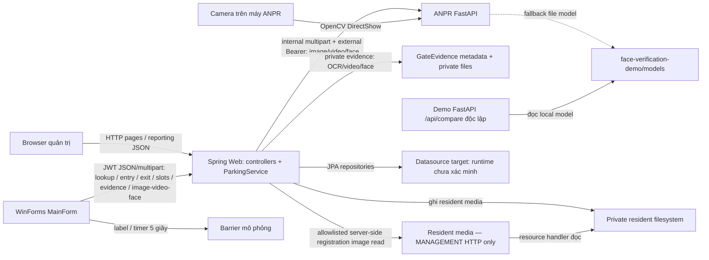

# Kiến trúc hệ thống — topology quan sát và ranh giới tích hợp

[Database](database.md) · [Phạm vi nghiệp vụ](../requirements/README.md) · [Traceability NV01–NV08](../requirements/traceability.md)

## Mục đích, phạm vi và cách đọc bằng chứng

Hệ thống hỗ trợ đăng ký hộ/người/xe/quyền, thẻ-gói-giá, trạm gác vào-ra, vị trí đỗ và báo cáo. AI hỗ trợ nhận biển/loại/mặt, không tự quyết quyền sử dụng xe. Chi tiết yêu cầu nằm trong tám NV, không thay đặc tả bằng diagram kiến trúc.

| Lớp bằng chứng | Ý nghĩa trong trang này |
| --- | --- |
| Kiến trúc đề xuất | Nội dung generator/QA; chưa chọn current-DOCX authority hoặc chứng minh feature đã chạy |
| Code observed | Symbol/call path/mapping đọc tĩnh; không runtime hoặc deployment PASS |
| Test hiện diện | Assertions được đọc hoặc file được index, không tự suy ra executed |
| Not verified / conflict | Chưa xác minh end-to-end/runtime/source lineage; không tự thành “không có” |

Code verification executed on 2026-10-09 is recorded below and in [testing strategy](../testing/strategy.md); it does not verify a deployed runtime. Documentation acceptance R02–R04 does not certify application readiness; R01 remains PARTIAL and NV06 retains its source-verification reservation.

## Thiết kế đề cương và topology thực tế

[Generator](../../tools/fill_thesis_proposal_15_20_pages.py):131–147 mô tả Web/WinForms → Spring REST → MySQL/AI, controlled file storage, RBAC/audit, offline queue/resync; :160 cũng cho phép Spring/Desktop gửi file hoặc safe path tới AI. Các bảng/controls đó là yêu cầu thiết kế, không schema/integration thực tế. [PDF no-EV final](../../evidence/qa/proposal-without-ev-charging-final/preview.pdf) pp.3–5 (evidence R01) chưa chứng minh DOCX authority.

Gate call path đã đọc: **Desktop → Spring → ANPR** cho image/video OCR và camera-face capture/verification; **Desktop → Spring** cho lookup/entry/exit/slots/evidence. Spring dùng repositories/JPA và filesystem. Spring reads resident registration images by allowlisted server reference or guest entry evidence, calls protected FastAPI routes with the internal Bearer, and stores private operation/session evidence. These source paths have H2/fake-service tests but no live service, production database, camera, or deployment proof.

Diagram dựng từ source, không từ bản render thesis chưa xác minh provenance; arrows thể hiện caller/data access, không triển khai mạng vật lý đã kiểm thử. Gate-evidence files are separate from resident uploads and static resource mapping. Không có arrow gate→demo API. Database node cố ý không gắn tên production engine chưa được chứng minh.

## Thành phần và trách nhiệm

| Thành phần / evidence | Vai trò và giới hạn |
| --- | --- |
| [Spring entry point](../../spring-web/src/main/java/vn/edu/parking/ParkingWebApplication.java):6–10; [pom](../../spring-web/pom.xml):6–39,52–73 | Spring Boot 3.5.5/Java21/Web/Thymeleaf/JPA/Validation/Security; MySQL driver runtime, H2 test scope. Không proof datasource production |
| [ParkingApiController](../../spring-web/src/main/java/vn/edu/parking/web/ParkingApiController.java):46–204 | Entry/exit delegation, OPEN/lookup, slots/dispatch/borrowing/batch/unassigned/health. Endpoint presence không proof toàn invariant |
| [ParkingService](../../spring-web/src/main/java/vn/edu/parking/service/ParkingService.java):40–506 | Kiểm nghiệp vụ/session/type/fee/slots; transactional methods với repositories; client face claims are rejected, while the three approved reasoned override cases are server-checked and audited |
| [AdminController](../../spring-web/src/main/java/vn/edu/parking/web/AdminController.java):59–83,635–675,725–858 | Dashboard/history/reporting và card MONTHLY/payment record; chỉ các body này có focused verification, không all admin workflow PASS |
| [Desktop project](../../desktop-winform/ParkingGateDesktop.csproj):1–9; [Program](../../desktop-winform/Program.cs):5–9 | .NET8 Windows/WinForms, MainForm startup; không chạy trực tiếp trên OS khác theo target này |
| [ParkingApiClient](../../desktop-winform/ParkingApiClient.cs):8–35,68–141 | Spring baseURL mặc định localhost:8080; image OCR 45s, video/face/camera proxy up to 60s, ordinary API operations 10s |
| [AnprApiClient](../../desktop-winform/AnprApiClient.cs):3–14 | Retained for ANPR health checks at localhost:8001; image/video/face processing uploads are sent through Spring |
| [ANPR main](../../anpr-service/app/main.py):17–57,129–243 | FastAPI, cached recognizer warm-up, face engine/camera handlers; every image/video/face processing route requires the external service Bearer, while health is public. Image/video caps are 10 MiB; no database persistence in these handlers |
| [Recognizer](../../anpr-service/app/recognizer.py):41–139 | YOLO biển + vehicle, EasyOCR, normalize, confidence/box/frame/annotated base64; CAR/MOTORBIKE/UNKNOWN và fallback hình biển, không six-category/EV-accuracy proof |
| [FaceEngine](../../anpr-service/app/face_engine.py):10–38,85–165 | YuNet/SFace, threshold decision và compare_best nhiều frames/CLAHE; model fallback và RLock native-state, không gate event lock |
| [Demo app](../../face-verification-demo/app.py):16–29,207–265 | UI/API độc lập, `/api/compare` nhận CCCD/registration/realtime và ba score; trả livenessChecked=false, không integrated gate enrollment proof |
| [ResidentImageStorage](../../spring-web/src/main/java/vn/edu/parking/service/ResidentImageStorage.java):18–24; [GateEvidenceStorage](../../spring-web/src/main/java/vn/edu/parking/service/GateEvidenceStorage.java):20–43; [GateEvidenceService](../../spring-web/src/main/java/vn/edu/parking/service/GateEvidenceService.java):228–335 | Resident media defaults to `var/private-media` and HTTP `/uploads/**` is MANAGEMENT-only. Gate evidence uses a separate private root and authenticated session/operation/kind/evidence-ID reads; GATE_STAFF is further limited to its owning desktop session and an OPEN parking session. Management may read any matching Gate Evidence only through that business route; no generic storage download is exposed. Reads are audited; 30-day retention and finite holds remain. H2 tests cover controls; effective runtime roots, encryption, backup/restore and production behavior are unverified |

## Luồng dữ liệu nghiệp vụ quan sát

| Luồng / call path | Dữ liệu / quyết định / giới hạn |
| --- | --- |
| Recognition: [MainForm](../../desktop-winform/MainForm.cs):166–187 → [ParkingApiClient](../../desktop-winform/ParkingApiClient.cs):72–121 → ParkingApiController → AnprServiceClient → ANPR image/video routes | Spring authenticates Desktop by JWT, checks bounded format/signature, forwards with external service Bearer, and stores private source/result-frame evidence. Entry consumes a recent plate/type result; exit binds recognition evidence to OPEN and consumes at confirm. Fake/H2 tests only; no live AI result or camera proof. Desktop still displays result; low confidence can select manual |
| Lookup: MainForm:233–264 → ParkingApiClient → controller lookup | Vehicle/card/pass and active authorized-member IDs/names/face-image-available; no registration image paths or guest evidence reference returned. Lookup display does not replace authorization checks |
| Verify face: MainForm:332–360 → ParkingApiClient:124–140 → Spring `/anpr/face/verify` → protected ANPR `/face/verify-camera` | Spring reads an active member's resident registration image or the guest entry evidence for the OPEN session; only server-side image bytes reach ANPR. Result and realtime frame are stored as private face evidence. No client URL fetch; operation/session binding is exercised with fake ANPR responses |
| Visitor capture: MainForm:363–382 → ParkingApiClient `/anpr/face/capture` → protected ANPR `/face/capture-camera` | Spring stores a private entry face capture. Capture remains optional; when supplied, its plate must match the server recognition and it is bound/consumed at entry. It is not client-provided proof |
| Entry: MainForm request → ParkingApiClient → controller → service | Spring requires matching recent recognition evidence; registered resident face entry requires backend PASS or one of the three approved, reasoned overrides (missing registration reference image, linked AI_REVIEW, or recorded recognition-service outage). Overrides require OVERRIDE_CREATE and preserve other business checks. Guest capture is optional; a supplied capture is bound to the resulting OPEN session. Warning missing/mismatched/expired pass can still create OPEN; UI may not open simulated barrier |
| Exit preview/confirm: MainForm → ParkingApiClient → controller → service | OPEN session lookup and recent exit recognition; guest with an entry-face image needs a recent PASS bound to that session. Resident face proof is accepted when supplied but not universally required. Preview does not consume; confirm recalculates fee, completes session, and consumes exit evidence transactionally |
| Pricing: service:426–467 → PricingRuleRepository | Type/session dates/card hiện tại; monthly eligibility dùng ngày entry + ACTIVE hiện tại; không payment settlement hoặc historical-rule snapshot |
| Reporting: browser/dashboard JS → AdminController:731–858 → session/payment repos | COMPLETED fee theo exitTime + SubscriptionPayment amount theo paidAt; filter month/year/range và detail/chart. Không proof visitor payment/reconciliation, xem [NV08](../requirements/nv08-reporting.md) |
| Slots: clients:31–108 → controller:104–195 → service:129–380 | Assignment/borrowing/status/release/dispatch/batch/unassigned; không physical occupancy sensor hoặc charging station integration |

Family rights theo **từng xe**, không tất cả xe trong hộ. Resident entry face verification is server-bound; resident exit face proof remains optional in current server policy. Guest exit face is required only when a guest entry-face image was stored; capture itself is optional. Source `CLOSED` khác code `COMPLETED`; không gộp hai tên thành implementation requirement đã đạt.

## Synchronous dependencies và failure boundaries

- HTTP clients await requests; no message broker/durable queue is observed. Desktop ordinary requests use 10s and image/video/face proxy calls use 45–60s; Spring's ANPR client uses a 45s whole-request timeout. These are client timeouts, not an end-to-end SLA. UI SetBusy does not prove one-event/per-lane idempotency.
- ANPR camera handler dùng lock + DirectShow (main:52–89); camera index0 mặc định từ Desktop và capture-camera. Camera phụ/RTSP/physical sensor/barrier chưa có proof integration trong scope này. Model locks không bảo vệ session/payment ở Spring.
- Spring→filesystem ghi bytes trước session save; DB transaction không bao gồm file hoặc timer barrier. DB/media/slot/client-response partial failures cần recovery evidence; không auto-resync/compensation guarantee.
- [ApiResponseReader](../../desktop-winform/ApiResponseReader.cs):8–37,47–74 chuyển HTTP/empty/HTML/JSON lỗi thành hướng dẫn kiểm tra/restart; đó không offline queue/resync. Mất response sau server commit còn outcome uncertainty, không suy ra gửi lại an toàn.
- Warm-up ANPR main:37–44 dựng recognizer/chạy frame đen; thiếu weights/deps có thể chặn startup. Face models lazy load; public FastAPI `/health` now exposes only process status `{status:"UP"}` and does not expose model/cache readiness, accuracy, liveness or DB health. Spring health controller:197–204 reads DB product name with `Unknown` fallback; it is not a verified UP guarantee until executed.

## Security và trust boundaries

[SecurityConfig](../../spring-web/src/main/java/vn/edu/parking/config/SecurityConfig.java):29–45 tách Web session chain khỏi Desktop JWT chain; resident `/uploads/**` chỉ `ROLE_MANAGEMENT`, unspecified `/api/**` and H2 routes are denied. Gate API authorization nằm ở JWT chain/method rules. Evidence media is private and served only by a session/operation/kind/evidence-ID business route. GATE_STAFF reads require matching owner account/device session and OPEN session; MANAGEMENT is allowed any matching Gate Evidence through this route, with actor/time/session/operation/evidence/action audit. Resident/CCCD media remains a separate permission. H2 tests do not verify deployment.

`ParkingService` rejects client-supplied true `faceVerified`/non-null `faceSimilarity` and exit-override booleans. Reasoned B1-A overrides are limited to a missing resident registration reference image, backend-linked AI_REVIEW, or backend-recorded recognition-service outage; they require OVERRIDE_CREATE and remain subject to ordinary business checks. Image/video OCR and camera-face calls traverse authenticated Spring routes to FastAPI processing routes with internal Bearer auth. Spring stores OCR/video/face evidence, uses server recognition at entry, and binds exit evidence to the open session. URL-fetch from client-supplied `registeredImageUrl` was removed. Evidence scopes, retention, and access auditing are verified only with H2/fake service; live service, production transport and database behavior remain unresolved.

Resident media save kiểm ≤10MB/decodable image rồi ghi original bytes vào UUID `.jpg`; default root là `var/private-media`, internal read allowlists UUID references and rejects symlinks/oversized/corrupt files, and resource mapping `/uploads/**` requires Management. Gate evidence is stored separately, expires after 30 days from capture, supports finite audited holds, and has daily expired/orphan cleanup; reads require session/operation/kind/evidence-ID binding and are audited. Gate staff access also requires matching owner/device session and OPEN session; Management access cannot use a generic file or UUID download route. This does not prove JPEG re-encoding, encryption, deployed paths, backup/restore, or DB-file rollback. Face engine quality warnings can coexist with PASS; liveness is computed but not used to block. Demo three-image flow also does not establish liveness.

## Runtime configuration và deployment assumptions

| Evidence | Cấu hình / boundary |
| --- | --- |
| Spring pom:18,52–68; entry point:8–9 | Java21/MySQL runtime driver/H2 test-only, args passed vào Spring; source datasource/profile URL/user/DDL mode vẫn chưa xác minh |
| R01 launcher evidence [run-web-laragon.ps1](../../scripts/run-web-laragon.ps1):35–39 và [run-all-laragon.ps1](../../scripts/run-all-laragon.ps1):21–30,41–44 | Launcher DB label/probe/environment không proof Spring chọn datasource; không chép credentials/env values. Không re-run launcher |
| Spring storage:18–20; GateEvidenceStorage:26–43 | Resident property `parking.upload-dir` defaults `var/private-media`; gate-evidence property defaults `var/private-gate-evidence`; both resolve relative to working directory and require writable/persistent storage. Effective runtime paths and backups are not verified |
| Desktop clients + MainForm; Spring ANPR client/application.yml | Desktop default localhost:8080/8001. Spring proxies image/video/face processing to `ANPR_BASE_URL` (default localhost:8001), sends `ANPR_SERVICE_TOKEN`; FastAPI expects the same externally provisioned token on processing routes. Missing/weak token fails closed (503); no real token was created or deployed |
| [ANPR requirements](../../anpr-service/requirements.txt):1–8, recognizer:58–73 | FastAPI/Uvicorn/YOLO/EasyOCR/OpenCV/NumPy/Pillow; ANPR_PLATE_MODEL/ANPR_VEHICLE_MODEL/default models, ANPR_GPU, confidence env vars; availability/install/metrics không tested |
| FaceEngine:10–16 | YuNet/SFace trong ANPR models hoặc demo/models; FACE_MATCH_THRESHOLD/REVIEW/DETECTION defaults trong source, chưa hiệu chỉnh site camera |
| [Desktop csproj](../../desktop-winform/ParkingGateDesktop.csproj):4–5, [ANPR main](../../anpr-service/app/main.py):52–89 | Windows .NET8; DirectShow camera remains on ANPR host. Remote deployment must review localhost/model/media/storage/camera and service-token configuration; there is no longer a client image URL fetch |

Demo là app ASGI riêng; conventional port8002 được project hướng dẫn mô tả, không hardcoded bind/integration từ app.py. Không tuyên bố container/network/TLS/production MySQL/H2 readiness, active profile hoặc credentials được cấp đúng từ các defaults trên.

## Test evidence, conflicts và câu hỏi còn mở

[ParkingFlowIntegrationTest](../../spring-web/src/test/java/vn/edu/parking/ParkingFlowIntegrationTest.java) ran 54/54 and the full Spring suite 108/108 on H2; `AnprServiceClientTest` ran 8/8 against a controlled local fake HTTP service; `WebRevenueSecurityIntegrationTest` ran 3/3. V1–V5 migration rehearsal ran on isolated H2 MySQL mode. Desktop Release build completed with 0 warnings/errors and tests ran 12/12. ANPR's prior test result was 10/10 with a fake recognizer and was not rerun for F1–F5 because that code/dependency set was unchanged. These are isolated evidence, not real camera/model/live FastAPI/production DB or end-to-end deployment proof. No operational datasource, production MySQL concurrency, live internal credential, TLS, or full replay/payment guarantees were verified.

- Source/lineage: DOCX/remaining QA và diagram originals chưa authority/provenance verified; component diagram mới chỉ từ static source. NV06 classification-only A vs charging B giữ riêng; không charging API/rights/hardware integration từ ParkingSlot/EV fuel.
- Mandatory resident exit face/rights, warning OPEN, conditional guest face, full AI/liveness/CCCD checks, idempotency/concurrent sessions/payments, payment/reason/settlement và manual audit/privacy còn gaps.
- Production datasource/profile/schema init, startup runner applicability/order, models/camera/network/site thresholds, recovery/backup/retention và transaction-media integrity cần evidence. Xem [NV07](../requirements/nv07-exceptions-recovery.md), [NV08](../requirements/nv08-reporting.md) và [database](database.md); không đặt quy tắc mới để lấp chỗ thiếu.
