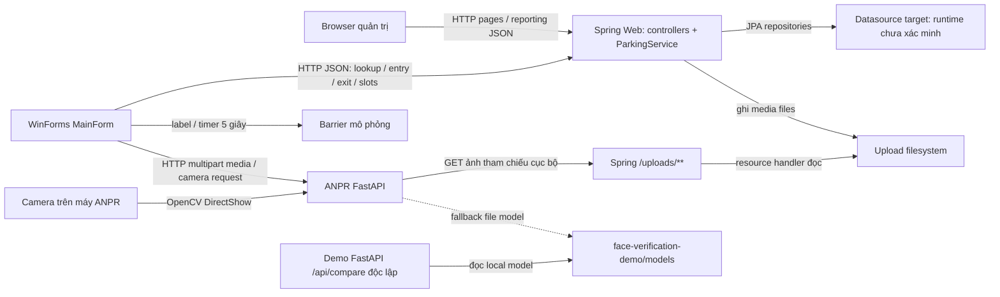

# Kiến trúc hệ thống — topology quan sát và ranh giới tích hợp

[Database](database.md) · [Phạm vi nghiệp vụ](../requirements/README.md) · [Traceability NV01–NV08](../requirements/traceability.md)

## Mục đích, phạm vi và cách đọc bằng chứng

Hệ thống hỗ trợ đăng ký hộ/người/xe/quyền, thẻ-gói-giá, trạm gác vào-ra, vị trí đỗ và báo cáo. AI hỗ trợ nhận biển/loại/mặt, không tự quyết quyền sử dụng xe. Chi tiết yêu cầu nằm trong tám NV, không thay đặc tả bằng diagram kiến trúc.

| Lớp bằng chứng | Ý nghĩa trong trang này |
| --- | --- |
| Kiến trúc đề xuất | Nội dung generator/QA; chưa chọn current-DOCX authority hoặc chứng minh feature đã chạy |
| Code observed | Symbol/call path/mapping đọc tĩnh; không runtime hoặc deployment PASS |
| Test hiện diện | Assertions được đọc hoặc file được index, không tự suy ra executed |
| Not verified / conflict | Chưa xác minh end-to-end/runtime/source lineage; không tự thành “không có” |

Không có test/app/build được chạy cho việc viết tài liệu; không có runtime verification mới. Acceptance tài liệu R02–R04 không chứng nhận application readiness; R01 vẫn PARTIAL và NV06 giữ source-verification reservation.

## Thiết kế đề cương và topology thực tế

[Generator](../../tools/fill_thesis_proposal_15_20_pages.py):131–147 mô tả Web/WinForms → Spring REST → MySQL/AI, controlled file storage, RBAC/audit, offline queue/resync; :160 cũng cho phép Spring/Desktop gửi file hoặc safe path tới AI. Các bảng/controls đó là yêu cầu thiết kế, không schema/integration thực tế. [PDF no-EV final](../../evidence/qa/proposal-without-ev-charging-final/preview.pdf) pp.3–5 (evidence R01) chưa chứng minh DOCX authority.

Gate call path đã đọc: **Desktop → ANPR** cho recognition/face và **Desktop → Spring** cho lookup/entry/exit/slots; Spring dùng repositories/JPA và filesystem. ANPR face-camera tải ảnh tham chiếu từ Spring uploads. Các caller đã kiểm tra không chứng minh Spring tự gọi AI hoặc gate gọi demo ba ảnh.

Diagram dựng từ source, không từ bản render thesis chưa xác minh provenance; arrows thể hiện caller/data access, không triển khai mạng vật lý đã kiểm thử. Không có arrow gate→demo API. Database node cố ý không gắn tên production engine chưa được chứng minh.

## Thành phần và trách nhiệm

| Thành phần / evidence | Vai trò và giới hạn |
| --- | --- |
| [Spring entry point](../../spring-web/src/main/java/vn/edu/parking/ParkingWebApplication.java):6–10; [pom](../../spring-web/pom.xml):6–39,52–73 | Spring Boot 3.5.5/Java21/Web/Thymeleaf/JPA/Validation/Security; MySQL driver runtime, H2 test scope. Không proof datasource production |
| [ParkingApiController](../../spring-web/src/main/java/vn/edu/parking/web/ParkingApiController.java):46–204 | Entry/exit delegation, OPEN/lookup, slots/dispatch/borrowing/batch/unassigned/health. Endpoint presence không proof toàn invariant |
| [ParkingService](../../spring-web/src/main/java/vn/edu/parking/service/ParkingService.java):40–506 | Kiểm nghiệp vụ/session/type/fee/slots; transactional methods với repositories; client faceVerified/manualOverride là trust boundary |
| [AdminController](../../spring-web/src/main/java/vn/edu/parking/web/AdminController.java):59–83,635–675,725–858 | Dashboard/history/reporting và card MONTHLY/payment record; chỉ các body này có focused verification, không all admin workflow PASS |
| [Desktop project](../../desktop-winform/ParkingGateDesktop.csproj):1–9; [Program](../../desktop-winform/Program.cs):5–9 | .NET8 Windows/WinForms, MainForm startup; không chạy trực tiếp trên OS khác theo target này |
| [ParkingApiClient](../../desktop-winform/ParkingApiClient.cs):8–35,38–117 | Spring baseURL mặc định localhost:8080, timeout10s; JSON requests/replies cho nghiệp vụ/slots |
| [AnprApiClient](../../desktop-winform/AnprApiClient.cs):9–46 | ANPR localhost:8001, timeout5phút; image/video multipart và verify/capture-camera HTTP |
| [ANPR main](../../anpr-service/app/main.py):17–44,121–221 | FastAPI, cached recognizer warm-up, face engine/camera handlers, recognition routes/limits; không database persistence trong các handlers này |
| [Recognizer](../../anpr-service/app/recognizer.py):41–139 | YOLO biển + vehicle, EasyOCR, normalize, confidence/box/frame/annotated base64; CAR/MOTORBIKE/UNKNOWN và fallback hình biển, không six-category/EV-accuracy proof |
| [FaceEngine](../../anpr-service/app/face_engine.py):10–38,85–165 | YuNet/SFace, threshold decision và compare_best nhiều frames/CLAHE; model fallback và RLock native-state, không gate event lock |
| [Demo app](../../face-verification-demo/app.py):16–29,207–265 | UI/API độc lập, `/api/compare` nhận CCCD/registration/realtime và ba score; trả livenessChecked=false, không integrated gate enrollment proof |
| [ResidentImageStorage](../../spring-web/src/main/java/vn/edu/parking/service/ResidentImageStorage.java):18–42; [WebConfig](../../spring-web/src/main/java/vn/edu/parking/config/WebConfig.java):9–14 | Filesystem media/UUID path, resource handler uploads; không DB blob hoặc protected storage đã xác minh |

## Luồng dữ liệu nghiệp vụ quan sát

| Luồng / call path | Dữ liệu / quyết định / giới hạn |
| --- | --- |
| Recognition: [MainForm](../../desktop-winform/MainForm.cs):154–195 → AnprApiClient:19–20,36–46 → ANPR:192–221 → recognizer | Chọn ảnh/video trên Desktop; ANPR trả plate/type/confidences/box/frame/annotated image. Desktop điền fields; low confidence có thể tự chọn manual. Type chính thức ở Spring lấy registry cho xe đã đăng ký |
| Lookup: MainForm:233–264 → ParkingApiClient:23–28 → controller:58–101 | Vehicle/card/pass, active authorized members và guest entry-face path. Lookup display không thay toàn bộ authorization gate |
| Verify face: MainForm:308–335 → client:22–27 → ANPR:152–174 | Selected member registration image hoặc guest entry photo URL; ANPR tải từ Spring cục bộ, capture trên máy ANPR, compare_best; Desktop chỉ PASS thành faceVerified, score/member ID. Verify image không tự lưu exit evidence qua ExitRequest |
| Visitor capture: MainForm:337–338 → client:29–33 → ANPR:177–189 | Capture8 frames, analyze frame cuối, base64 → Desktop entry request → saveCaptured optional. Không bắt buộc đã capture trong EntryAsync |
| Entry: MainForm:211–230 → client:19 → controller:46–47 → service:40–94 | Normalize/OPEN precheck/member/card/pass, save OPEN/flags/optional face + assignSlot; warning thiếu/sai thẻ/hết pass **vẫn tạo OPEN**, UI có thể chưa tự mở |
| Exit preview/confirm: MainForm:272–305 → client:20–21 → controller:49–53 → service:97–126 | Lookup OPEN, conditional guest-face helper, tính fee; preview không đổi DB state. Confirm tính lại, COMPLETED, lưu flags/score và clear slot đầu tiên tìm theo currentSession |
| Pricing: service:426–467 → PricingRuleRepository | Type/session dates/card hiện tại; monthly eligibility dùng ngày entry + ACTIVE hiện tại; không payment settlement hoặc historical-rule snapshot |
| Reporting: browser/dashboard JS → AdminController:731–858 → session/payment repos | COMPLETED fee theo exitTime + SubscriptionPayment amount theo paidAt; filter month/year/range và detail/chart. Không proof visitor payment/reconciliation, xem [NV08](../requirements/nv08-reporting.md) |
| Slots: clients:31–108 → controller:104–195 → service:129–380 | Assignment/borrowing/status/release/dispatch/batch/unassigned; không physical occupancy sensor hoặc charging station integration |

Family rights theo **từng xe**, không tất cả xe trong hộ. Resident exit có optional verify UI nhưng confirm path không bắt buộc VerifyFaceAsync/verifyDriver; field exitMember không được set trong confirm body. Guest exit chỉ bắt face khi vehicle null và có entryFaceImagePath, trừ override. Source `CLOSED` khác code `COMPLETED`; không gộp hai tên thành implementation requirement đã đạt.

## Synchronous dependencies và failure boundaries

- HTTP client awaits requests; không thấy message broker/durable queue trong các call paths đã đọc. Spring timeout10s và ANPR5phút là defaults client, không end-to-end SLA. UI SetBusy cho recognition/face không chứng minh một-event/per-lane idempotency.
- ANPR camera handler dùng lock + DirectShow (main:52–89); camera index0 mặc định từ Desktop và capture-camera. Camera phụ/RTSP/physical sensor/barrier chưa có proof integration trong scope này. Model locks không bảo vệ session/payment ở Spring.
- Spring→filesystem ghi bytes trước session save; DB transaction không bao gồm file hoặc timer barrier. DB/media/slot/client-response partial failures cần recovery evidence; không auto-resync/compensation guarantee.
- [ApiResponseReader](../../desktop-winform/ApiResponseReader.cs):8–37,47–74 chuyển HTTP/empty/HTML/JSON lỗi thành hướng dẫn kiểm tra/restart; đó không offline queue/resync. Mất response sau server commit còn outcome uncertainty, không suy ra gửi lại an toàn.
- Warm-up ANPR main:37–44 dựng recognizer/chạy frame đen; thiếu weights/deps có thể chặn startup. Face models lazy load; readiness main:121–129/FaceEngine:28–38 dựa files/cache, không accuracy/liveness/DB health tổng thể. Spring health controller:197–204 đọc DB product name, fallback Unknown; không UP guarantee khi chưa thực thi.

## Security và trust boundaries

[SecurityConfig](../../spring-web/src/main/java/vn/edu/parking/config/SecurityConfig.java):17–32 có form login/in-memory ADMIN, password `{noop}` (không chép giá trị credential); API/uploads/H2 paths permitAll, CSRF excluded API/H2. AdminController revenue API nằm dưới `/api/**`, không tự ADMIN-only vì tên controller. Pages khác authenticated không đồng nghĩa role matrix gate/business-source đã enforced.

Spring tin faceVerified/manualOverride/score client trong helpers; service không kiểm chứng signed AI evidence, liveness threshold hoặc remote caller role trong body đã đọc. ANPR verify-camera main:154 chỉ cho URL prefix localhost/127.0.0.1 có port và urlopen ảnh, không TLS/production authorization proof. Gọi camera từ Desktop không chứng minh API biometric privacy đã hardened.

Media save kiểm ≤10MB/decodable image rồi ghi original bytes vào UUID `.jpg`; không chứng minh JPEG re-encode, encryption/retention/download logging hoặc DB-file rollback. WebConfig phục vụ upload root và security cho public uploads. Face engine quality warnings có thể kèm PASS; main:162–164 tính liveness nhưng không đưa vào blocking decision. Demo ba ảnh cũng trả livenessChecked=false.

## Runtime configuration và deployment assumptions

| Evidence | Cấu hình / boundary |
| --- | --- |
| Spring pom:18,52–68; entry point:8–9 | Java21/MySQL runtime driver/H2 test-only, args passed vào Spring; source datasource/profile URL/user/DDL mode vẫn chưa xác minh |
| R01 launcher evidence [run-web-laragon.ps1](../../scripts/run-web-laragon.ps1):35–39 và [run-all-laragon.ps1](../../scripts/run-all-laragon.ps1):21–30,41–44 | Launcher DB label/probe/environment không proof Spring chọn datasource; không chép credentials/env values. Không re-run launcher |
| Spring storage:18–20 | Property parking.upload-dir default relative uploads, resolve absolute theo working directory; cần filesystem writable/persistent, không tự coi shared volume/backup configured |
| Desktop clients + MainForm:388 | Default localhost:8080/8001, URL fields cấu hình client. Đây là expected destinations, không verification bind/listen port server |
| [ANPR requirements](../../anpr-service/requirements.txt):1–8, recognizer:58–73 | FastAPI/Uvicorn/YOLO/EasyOCR/OpenCV/NumPy/Pillow; ANPR_PLATE_MODEL/ANPR_VEHICLE_MODEL/default models, ANPR_GPU, confidence env vars; availability/install/metrics không tested |
| FaceEngine:10–16 | YuNet/SFace trong ANPR models hoặc demo/models; FACE_MATCH_THRESHOLD/REVIEW/DETECTION defaults trong source, chưa hiệu chỉnh site camera |
| [Desktop csproj](../../desktop-winform/ParkingGateDesktop.csproj):4–5, main:55–74 | Windows .NET8 và DirectShow camera trên máy ANPR; remote deployment cần khác assumptions localhost/image URL/model/media/camera locations |

Demo là app ASGI riêng; conventional port8002 được project hướng dẫn mô tả, không hardcoded bind/integration từ app.py. Không tuyên bố container/network/TLS/production MySQL/H2 readiness, active profile hoặc credentials được cấp đúng từ các defaults trên.

## Test evidence, conflicts và câu hỏi còn mở

[ParkingFlowIntegrationTest](../../spring-web/src/test/java/vn/edu/parking/ParkingFlowIntegrationTest.java):38–41 H2 memory/create-drop và test upload root; :51–104 entry/preview/exit/monthly-fee subset; :114–126 guest client-flag branch; :106–112 admin page200; :128–218 registration/QR/prices/authorized-list assertions. Test hiện diện, **chưa chạy**; không real camera/model/Desktop/network/production DB/idempotency/payment audit proof. ANPR/demo tests được index trong traceability, không nâng thành integrated runtime results.

- Source/lineage: DOCX/remaining QA và diagram originals chưa authority/provenance verified; component diagram mới chỉ từ static source. NV06 classification-only A vs charging B giữ riêng; không charging API/rights/hardware integration từ ParkingSlot/EV fuel.
- Mandatory resident exit face/rights, warning OPEN, conditional guest face, full AI/liveness/CCCD checks, idempotency/concurrent sessions/payments, payment/reason/settlement và manual audit/privacy còn gaps.
- Production datasource/profile/schema init, startup runner applicability/order, models/camera/network/site thresholds, recovery/backup/retention và transaction-media integrity cần evidence. Xem [NV07](../requirements/nv07-exceptions-recovery.md), [NV08](../requirements/nv08-reporting.md) và [database](database.md); không đặt quy tắc mới để lấp chỗ thiếu.
